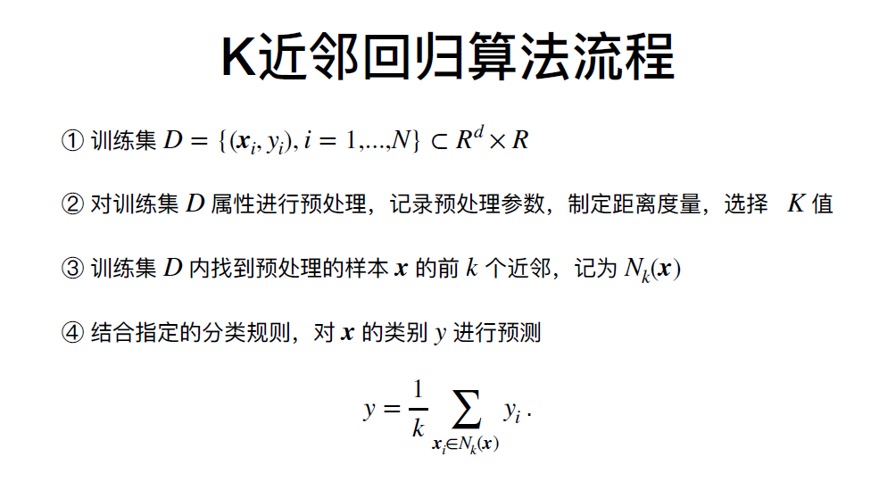
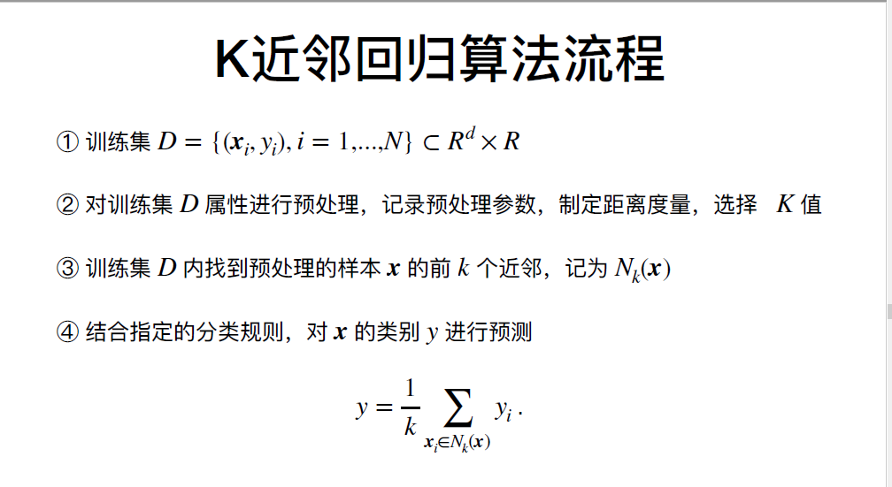
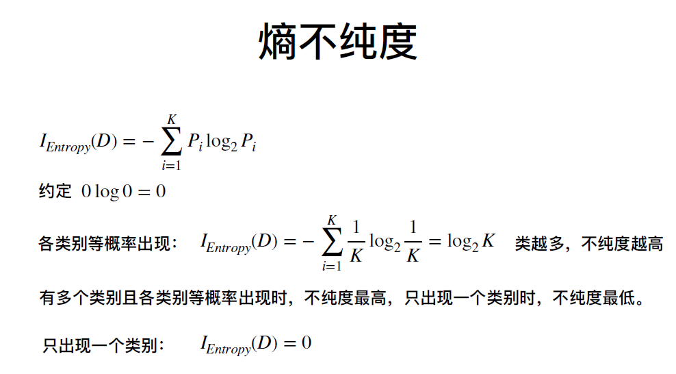
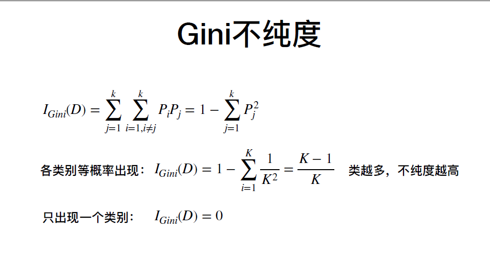
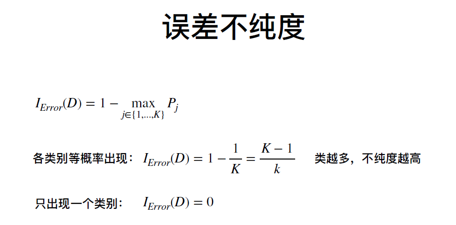

## 2020.9.20 王琪老师   K近邻
## 3.1 K近邻
* 模型思想：近朱者赤近墨者黑
* 懒惰学习（无显示训练过程），非参数模型
* 数据集、距离度量方式、近邻数、决策规则（多数表决、加权投票）等决定了模型能力
* 度量方式：Lp距离、绝对值距离、欧式距离、切氏距离
* 使用交叉验证或验证集对K值进行选择
* 使用KD（决策树）树提升搜索速度
* * 平衡二叉树（折半查找）
* 如果K值为偶数出现平票的情况（1样本集中那个类别的样本多，选哪一个样本、或者最近的类别）

### K近邻分类算法的流程

### K近邻回归算法的流程

## 3.2 决策树
* 模型思想：分而治之
* 包括ID3 、 C4.5 、Cart分类/回归树
* 既可以处理度量特征，又可以处理非度量性特征（ID3不能处理非度量特征）
* 不纯度度量方式：熵不纯度度，基尼不纯度、误差不纯度
* 模型决策速度快、语义可表示、可嵌入专家的先验知识

### 熵不纯度

### 基尼不纯度

### 误差不纯度

### 利用不纯度进行特征选择
* 期望优先使用划分后使得纯度最大的属性划分
* 利用不纯度计算公式可得最优划分属性

