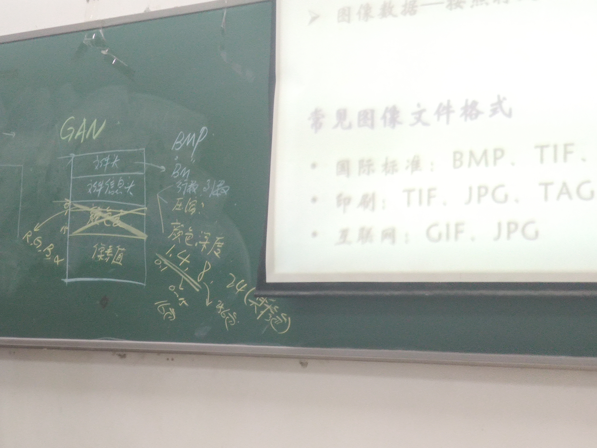

## 数字图像处理的基本内容
* 图像的几何变换
* 图像的灰度变换
* 图像的平滑与锐化
* 图像的复原
* 图像的边缘检测、图像的分隔
* 图像的特征提取、表示、描述

## 拓展部分
* 机器学习+图像处理  
* CVPP  TCCV    ECCV     ACCV   ICMC

## 什么是数字图像处理
* 图像、
* 客观世界（3D） -> 观测系统 -> 实体（图像-2D）直接或间接作用于人眼,产生视觉 

#### 数字高程图（BEM）

## 常见的图像的格式
* 国际标准：BMP     TIF         JPG
* 印刷：    TIF     JPG     TAG     PCX
* 互联网：  GIF     JPG
"""
文件头
文件信息大  行数、列数、颜色深度（1、4  、8）
颜色表      
组成图像对应的每一个像素值 

注： 每个像素用24位二进制存放（真彩色）
"""

### 相关的库
* opencv(2)  scikit-image(1)  scipy  PIL  Pillow    PyTorch